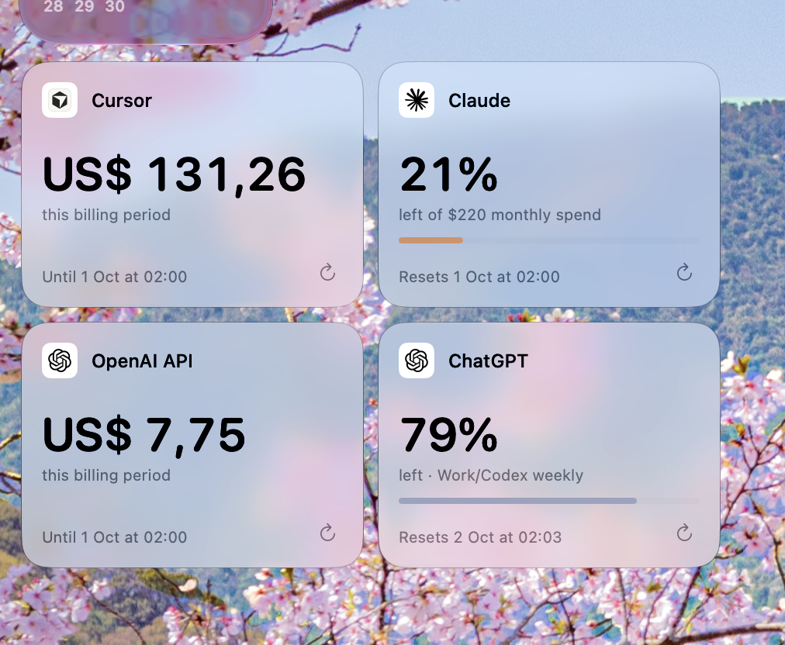
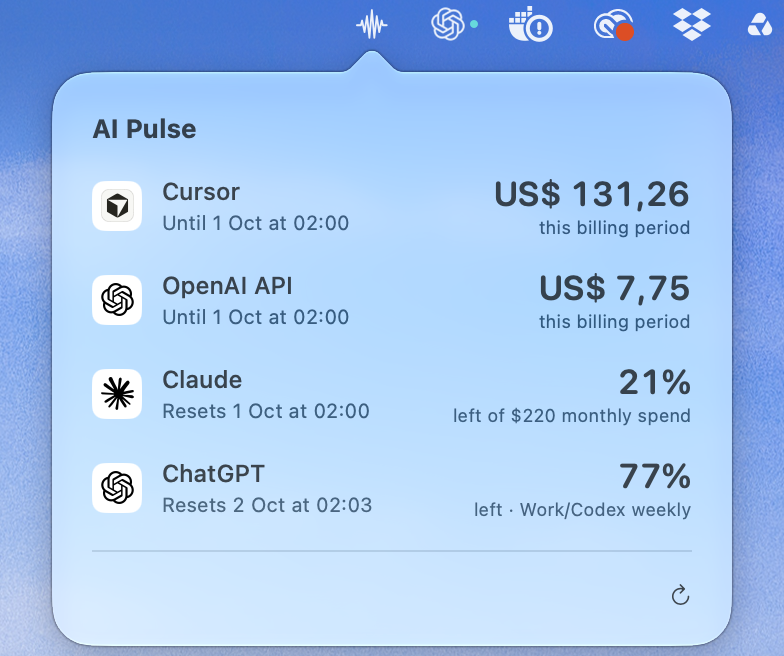
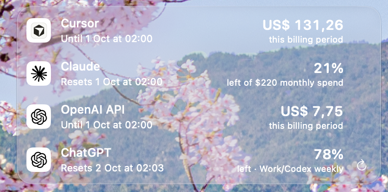
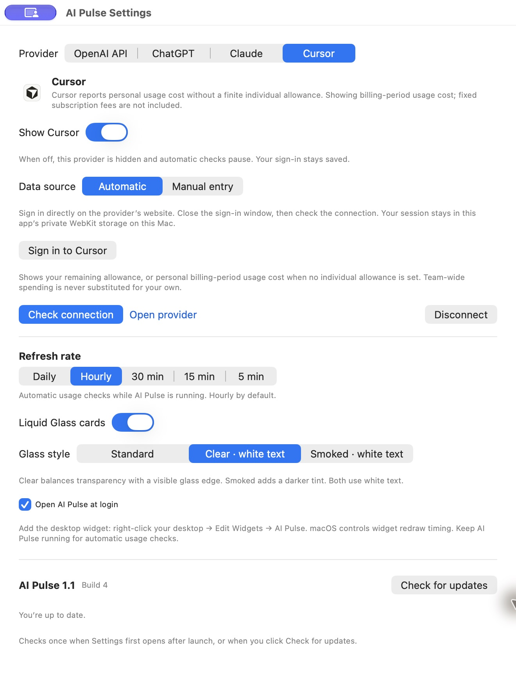

# AI Pulse

A native macOS menu-bar app and desktop dashboard for AI subscription usage. Each provider shows billing-period usage cost or the percentage remaining until its reset date.

## Install

Download the **AI Pulse DMG** from [GitHub Releases](https://github.com/mbosschaart/AI-Pulse/releases/latest), open it, and drag **AI Pulse.app** to Applications. A ZIP download is also available. Requires macOS 14 or later; native Liquid Glass styles require macOS 26 or later.

Version **1.0** is the first full release, Developer ID signed and notarized by Apple.

## Use

- Right-click the menu-bar icon for **Show Widget**, **Settings…**, or **Quit AI Pulse**. Left-click shows usage.
- Settings is a separate, resizable window. Drag its title bar beside the cards to see appearance changes live; its position is remembered.
- Right-click a card for **Cards** or **Compact**. Cards initially form a horizontal row, then remember your arrangement. Compact removes dividers and uses tightly spaced rows.
- Drag normally to move the dashboard. Hold **Shift** to move a card. The full card follows the pointer; an edge highlight previews its placement. Drop near top/bottom to create a row, or left/right to join one. Out-of-range drops cancel without exporting clipping files.
- Each provider configuration has a Show switch. Hidden providers retain their sign-in and pause automatic account checks.
- Settings offers Liquid Glass in Standard, Clear with white text, or Smoked with white text. The selected style is saved.
- Cards have individual refresh icons; Compact has one bottom-right refresh icon for all visible providers. Account usage refreshes approximately every five minutes while awake, independently of software update checks.
- Add the WidgetKit widget through desktop → Edit Widgets → AI Pulse. macOS controls widget redraw timing.

### Toolbar view

Click the AI Pulse icon in the macOS menu bar for a quick overview of all visible providers, their usage, and reset dates. Use the refresh icon to update the readings, or right-click the menu-bar icon for Settings, Show Widget, and Quit.

### Compact view

Keep all four providers in a small, readable list with transparent glass and a single refresh-all control.

## Connect providers

**OpenAI API:** use an organization Admin API key with cost-reading permission. A normal project inference key is insufficient. The default billing window is the UTC calendar month. The key stays in macOS Keychain.

**ChatGPT:** sign in on the provider page, close the sign-in window, then check the connection. Tracks the shared Work/Codex allowance, not an overall quota for every ChatGPT feature.

**Claude:** sign in and choose an organization if required. Uses the lowest reported remaining session/weekly allowance; Enterprise accounts without those windows can display remaining percentage of their monthly spend allowance.

**Cursor:** sign in and check the connection. Shows personal remaining allowance when available, otherwise individual billing-period usage cost. Team spending is never substituted, and usage credits are not represented as invoice charges.

Manual cost/percentage entry is also available. Manual values do not auto-renew. Expired or unavailable data is marked rather than replaced by a guessed value.

### Settings

Manage provider connections, choose which cards appear, and change the glass style. Move Settings beside the cards to preview your changes.

## Software updates

AI Pulse can download and install new versions from GitHub Releases, then relaunch in place. Downloads are verified before installation.

There are **no scheduled or app-launch update checks**, automatic downloads, or silent installations. A check runs once when Settings first opens in each app session; **Check for updates** triggers another on demand. Version and build number appear in Settings. Network failures can be retried with that button.

## Privacy

No backend, telemetry, browser-profile import, or cloud account. Provider sign-ins use separate persistent app-owned WebKit stores. Passwords are entered on the providers’ pages. Credentials and raw account responses are never shared with the widget. Only sanitized readings and appearance preferences are written to the App Group. Software-update requests go to GitHub; Sparkle system-profile reporting is disabled.

OpenAI uses its documented Costs API. ChatGPT, Claude, and Cursor integrations use private same-origin dashboard endpoints and may need maintenance when those providers change. Complete MFA on the provider page. Failed checks keep a marked last-known reading and use retry backoff.
