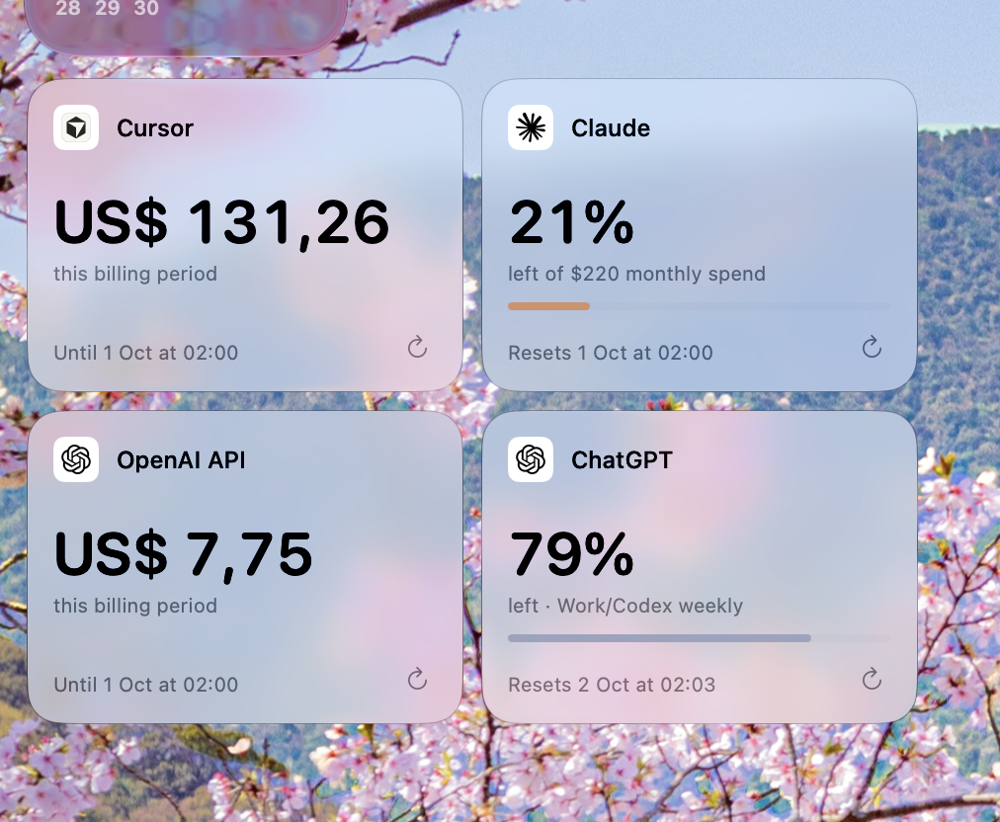
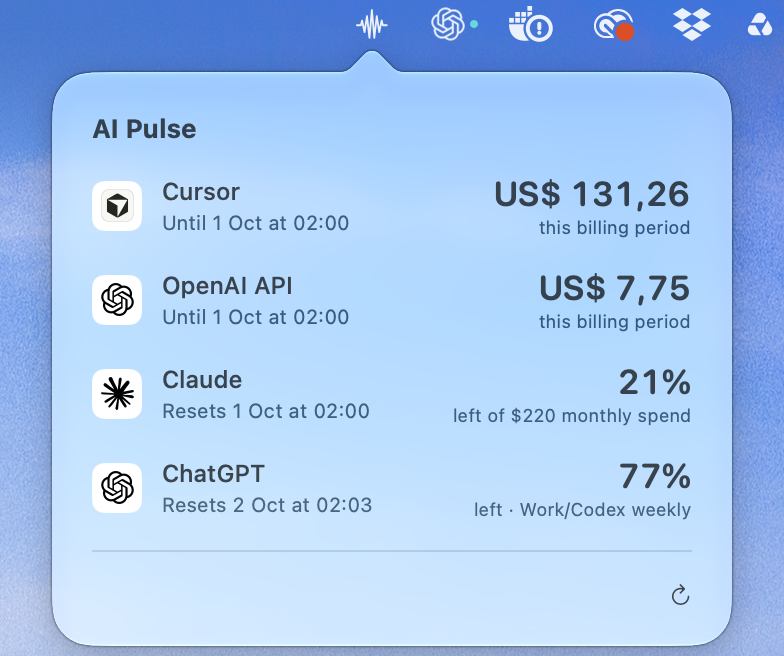
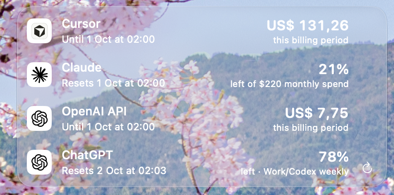
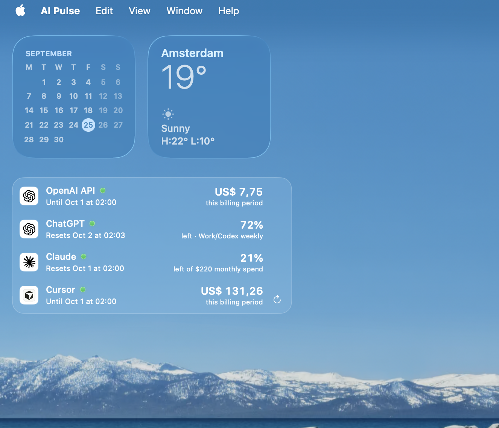
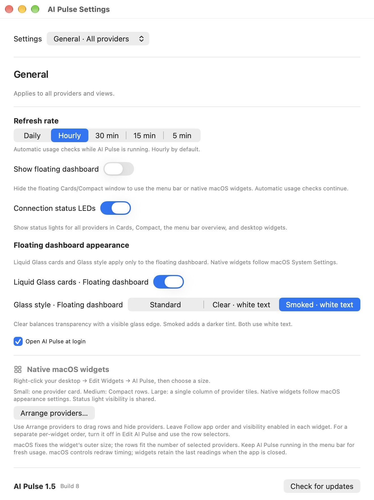
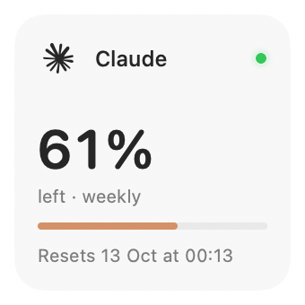
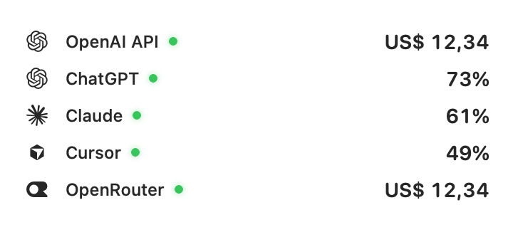
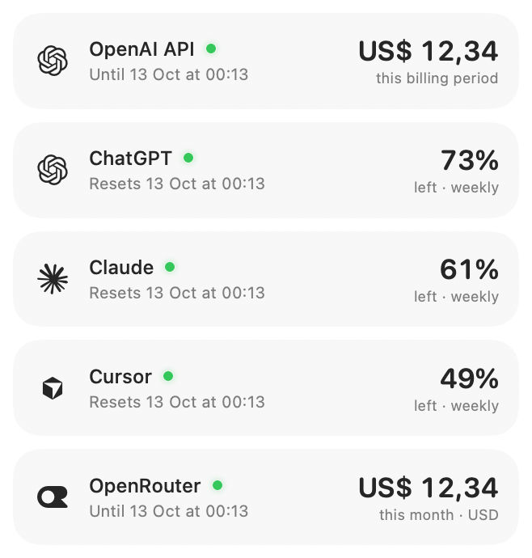
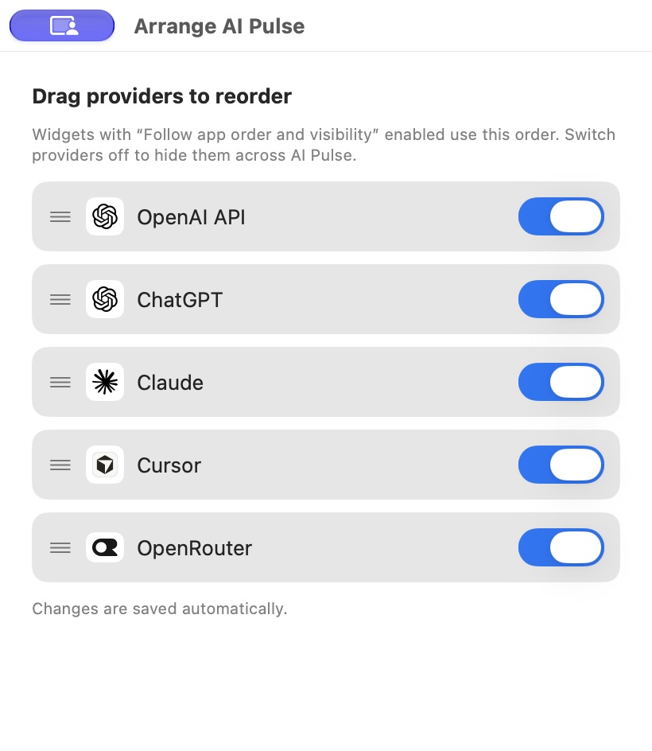

# AI Pulse

A native macOS menu-bar app, floating dashboard, and WidgetKit widgets for AI subscription usage. Each provider shows billing-period usage cost or the percentage remaining until its reset date.

## Install

Download the **AI Pulse DMG** from [GitHub Releases](https://github.com/mbosschaart/AI-Pulse/releases/latest), open it, and drag **AI Pulse.app** to Applications. A ZIP download is also available. Requires macOS 14 or later; the floating dashboard’s native Liquid Glass styles require macOS 26 or later.

Version **1.5** is Developer ID signed and notarized by Apple. This README documents **1.6 (build 9)**, including the latest native-widget improvements. Its release packages are being prepared; the latest published download remains 1.5 until 1.6 is published.

## Choose your view

The **floating dashboard is the more versatile and configurable option**: choose Cards or Compact, arrange cards freely into rows, and select your own Liquid Glass style. **Native macOS widgets** integrate with the desktop and Notification Center, but use preset sizes and layouts controlled by WidgetKit. You can select, reorder, and hide their providers within those layouts.

| | Floating dashboard | Native macOS widgets |
| --- | --- | --- |
| Layout | Cards arranged into rows, or a compact list | Small: one card; medium: minimal rows; large: one column |
| Size and placement | Move freely; content fits the visible providers | Fixed macOS size families and system placement |
| Provider arrangement | Shift-drag cards, or use Arrange providers in Settings | Settings drag editor or per-widget row selectors |
| Appearance | Liquid Glass cards with Standard, Clear, or Smoked style | Follows macOS widget appearance settings |
| Refresh | Manual controls and scheduled checks | Displays readings supplied by the running app; macOS schedules redraws |

Use either view or both. Hiding the floating dashboard keeps the menu-bar app and automatic checks running.

## Floating dashboard and menu bar

- Right-click the menu-bar icon for **Show Floating Dashboard** / **Hide Floating Dashboard**, **Settings…**, or **Quit AI Pulse**. Left-click shows usage.
- Turn off **Show floating dashboard** in General Settings to use the menu-bar overview and/or native widgets without a floating window. This choice is remembered across restarts; automatic refresh continues. AI Pulse runs without a Dock icon.
- Settings is a separate, resizable window. Drag its title bar beside the cards to see appearance changes live; its position is remembered.
- Right-click a card for **Cards** or **Compact**. Cards initially form a horizontal row, then remember your arrangement. Compact removes dividers and uses tightly spaced rows.
- The dashboard remembers its position between runs, including the Compact view’s top edge. Drag normally to move the dashboard. Hold **Shift** to move a card. The full card follows the pointer; an edge highlight previews its placement. Drop near top/bottom to create a row, or left/right to join one. Out-of-range drops cancel without exporting clipping files.
- Each provider configuration has a Show switch. Hidden providers retain their sign-in and pause automatic account checks.
- For the floating dashboard only, Settings offers Liquid Glass in Standard, Clear with white text, or Smoked with white text. The selected style is saved.
- Cards have individual refresh icons; Compact has one bottom-right refresh icon for all visible providers. Choose automatic usage checks in Settings: **Daily**, **Hourly** (the default), **30 min**, **15 min**, or **5 min**. Manual refresh is always available, independently of software update checks.

### Toolbar view

Click the AI Pulse icon in the macOS menu bar for a quick overview of all visible providers, their usage, and reset dates. Use the refresh icon to update the readings, or right-click the menu-bar icon for Settings, Show Floating Dashboard, and Quit.

### Compact view

Keep your providers in a small, readable list with optional status LEDs and a single refresh-all control.

### On your desktop

AI Pulse in Compact view alongside the macOS Calendar and Weather widgets, showing its size and how Clear glass fits into a desktop layout.

### Connection health

The global **Connection status LEDs** switch in Settings shows or hides status lights across all providers and views (on by default). A small status light shows connection health: green for a successful current reading, amber when a refresh is needed, red when sign-in is required, and gray for unconnected or manually entered accounts. Freshness follows your chosen refresh rate. The last-updated date appears only in the provider’s Settings.

Green confirms the most recent successful usage check is still current; it does not continuously verify the provider session between checks. Failed checks never show green.

## Native macOS widgets

Native WidgetKit widgets are separate from the floating Cards/Compact dashboard. They require macOS 14 or later and use macOS’s preset formatting. The following tutorial covers version 1.6.

### 1. Prepare AI Pulse

1. Install AI Pulse in Applications and launch it at least once.
2. Open **Settings** from the AI Pulse menu-bar icon. Connect the providers you want to monitor and check that their readings refresh.
3. In **General**, choose your refresh interval. You can turn off **Show floating dashboard** while continuing to use native widgets. Keep AI Pulse running in the menu bar for fresh readings; **Open AI Pulse at login** is optional.

*Screenshot of AI Pulse Settings. Your appearance choices may differ.*

### 2. Add a widget

1. Right-click an empty part of your desktop and choose **Edit Widgets**.
2. Search for **AI Pulse** in the widget gallery.
3. Select a size, then click its add button or drag the preview onto the desktop.
4. Click **Done**. Drag the whole widget to reposition it.

For Notification Center, click the date/time in the menu bar, choose **Edit Widgets**, and add AI Pulse there. Apple's [illustrated macOS widget guide](https://support.apple.com/guide/mac-help/add-and-customize-widgets-mchl52be5da5/mac) covers the system gallery and desktop controls.

| Size | Presentation |
| --- | --- |
| Small | One provider card. Right-click → **Edit AI Pulse** to select its provider. |
| Medium | Minimal rows: provider, status light, and usage value only. Rows stay compact for any provider count. |
| Large | One column of provider tiles with usage and period details. |

*Rendered examples from the actual widget views using sample data, not screenshots of the macOS gallery. macOS fixes each widget’s outer dimensions. Medium rows stay compact when providers are hidden; macOS controls the background and reserves the full medium footprint. Reset dates and secondary metric labels appear in small/large widgets, not medium.*

### 3. Reorder or hide providers

For drag-and-drop arrangement shared by your widgets:

1. Right-click a medium or large widget → **Edit AI Pulse** and leave **Follow app order** on (the default).
2. Open **AI Pulse Settings → General → Arrange providers**.
3. Drag a provider row above or below another. A placement indicator shows where it will land.
4. Turn a provider’s switch off to hide it. Changes save automatically; macOS schedules the widget redraw.

Hiding here applies across AI Pulse and pauses automatic checks for that provider; it preserves the sign-in. The floating dashboard’s Shift-drag ordering also updates widgets that follow app order.

To hide a row on one medium or large widget, right-click → **Edit AI Pulse** and set it to **Hidden**. This works whether Follow app order is on or off.

For a separate order on one medium or large widget, right-click → **Edit AI Pulse**, turn **Follow app order** off, and choose its first through fifth rows. Choose **Hidden** for unwanted rows. Duplicate selections appear once; providers disabled globally stay hidden. Small widgets use their own provider selector.

WidgetKit does not support arbitrary row-drag gestures or app-defined context-menu commands on the desktop widget. Its right-click menu is provided by macOS. Opening AI Pulse from that menu takes you to Settings. Clicking a provider opens its Settings page. There is no Arrange button on the widget face; the drag editor lives in Settings.

### 4. Appearance and status

Native widgets follow **macOS System Settings → Desktop & Dock → Widgets**, including the system’s full-color, monochrome, or tinted presentation. Text and transparent provider marks use adaptive system colors for light and dark appearances.

Gallery previews use sample readings and a transparent background, with adaptive text and provider marks. Reopen Edit Widgets after updating AI Pulse to request fresh previews.

**Liquid Glass cards** and **Glass style** in AI Pulse Settings apply **only to the floating dashboard**. Changing them does not change native widgets. Status-light visibility and globally enabled providers are shared; each widget can further select which providers it displays.

- Green: a current, successful automatic reading.
- Orange: stale data or a reading needing a successful refresh.
- Red: sign-in is required again.
- Gray: disconnected or manually entered usage.

macOS can apply monochrome or tinted widget presentation, which may alter colors. On macOS 26 and later, AI Pulse preserves status-light colors in accented mode; other widget content follows the system. Desktop & Dock settings control this system appearance; labels vary by macOS version.

### Troubleshooting

- **AI Pulse is missing from the gallery:** launch the installed app once, then reopen Edit Widgets. Confirm you installed a build containing the native extension.
- **The widget keeps an old order:** ensure Follow app order is on. With Follow app order off, row selectors determine the order. Hidden rows are excluded in either mode.
- **A provider is missing:** enable it in AI Pulse. Check the per-widget row selections too. For a small widget, check its provider selector; a disabled selection shows setup guidance rather than another provider’s data.
- **Usage is old:** keep the menu-bar app running and refresh its readings. WidgetKit schedules redraws; a successful app refresh does not guarantee an immediate widget redraw.
- **The widget remains after quitting:** expected. It displays cached readings, which become stale or expire; it does not retain provider credentials or fetch authenticated usage itself.

## Connect providers

**OpenAI API:** use an organization Admin API key with cost-reading permission. A normal project inference key is insufficient. The default billing window is the UTC calendar month. The key stays in macOS Keychain.

**ChatGPT:** sign in on the provider page, close the sign-in window, then check the connection. Tracks the shared Work/Codex allowance, not an overall quota for every ChatGPT feature.

**Claude:** sign in and choose an organization if required. Uses the lowest reported remaining session/weekly allowance; Enterprise accounts without those windows can display remaining percentage of their monthly spend allowance.

**Cursor:** sign in and check the connection. Shows personal remaining allowance when available, otherwise individual billing-period usage cost. Team spending is never substituted, and usage credits are not represented as invoice charges.

**OpenRouter:** add a [Management API key](https://openrouter.ai/settings/management-keys) in Settings. Shows account-wide Activity total spend in USD for the current UTC month using the [Analytics API](https://openrouter.ai/docs/api/api-reference/analytics/query-analytics-data). Organization keys include organization-wide spend; use a personal-account key for personal totals. Regular inference keys cannot read account-wide analytics. Credit purchases and prepaid balances are not monthly spend. The key stays in macOS Keychain.

Manual cost/percentage entry is also available. Manual values do not auto-renew. Expired or unavailable data is marked rather than replaced by a guessed value.

### Cursor teams

In Settings → Cursor, click **Load teams**, choose a **Team / workspace** or **All teams · combined personal cost**, then click **Check connection**. The choice is remembered. Combined usage adds only your personal costs for matching billing periods; it excludes other members and fixed subscription fees. If periods differ or a personal cost total is missing, choose an individual team.

### Settings

Use the Settings dropdown to choose **General · All providers** or a specific provider. General contains refresh rate, floating-dashboard visibility and appearance, status LEDs, native-widget provider arrangement, launch-at-login, and software updates. Provider pages contain connection details, visibility, and last-updated time. Clicking an unconfigured card or Compact entry opens that provider directly. Move Settings beside the cards to preview your changes.

See the [General Settings screenshot above](#1-prepare-ai-pulse).

The refresh rate is saved across launches and applies to enabled providers. After sleep, an overdue check runs when the Mac wakes. Longer intervals keep readings valid until their next scheduled check; failed checks and expired allowances remain clearly marked. Desktop widget redraw timing is still controlled by macOS.

## Software updates

AI Pulse can download and install new versions from GitHub Releases, then relaunch in place. Downloads are verified before installation.

There are **no scheduled or app-launch update checks**, automatic downloads, or silent installations. A check runs once when Settings first opens in each app session; **Check for updates** triggers another on demand. Version and build number appear in Settings. Network failures can be retried with that button.

## Privacy

No backend, telemetry, browser-profile import, or cloud account. Provider sign-ins use separate persistent app-owned WebKit stores. Passwords are entered on the providers’ pages. Credentials and raw account responses are never shared with the widget. Only sanitized readings and status-light visibility are written to the App Group. Software-update requests go to GitHub; Sparkle system-profile reporting is disabled.

OpenAI uses its documented Costs API. ChatGPT, Claude, and Cursor integrations use private same-origin dashboard endpoints and may need maintenance when those providers change. Complete MFA on the provider page. Failed checks keep a marked last-known reading and use retry backoff.
